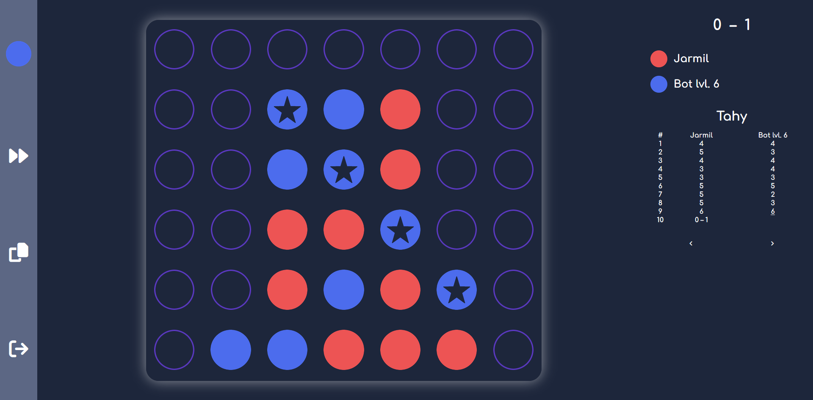

# Connect Four
Implementace populární deskové hry Connect Four v JavaScriptu. Hra nabízí lokální PvP a boty založené na minimax algoritmu. Lze taktéž vidět statistiky a hry komplexně analyzovat.
## Instalace
Pro instalaci stačí stáhnout zazipovaný kód a v prohlížeči otevřít index.html nebo jde hrát [online](http://connectfour.zizkovsky.eu)
## Features
- bot s minimax algoritmem
- statistiky
- počítání skóre
- vzdávání se
- analýza odehraných her a prázdné hry
## Jak to vypadá

## Licence
&copy; Václav Žižkovský 2024, vydáno pod licencí [MIT](https://choosealicense.com/licenses/mit/)
